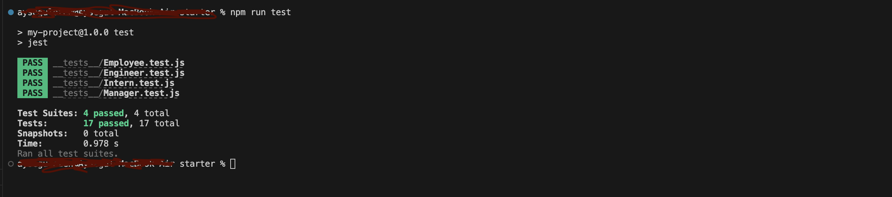
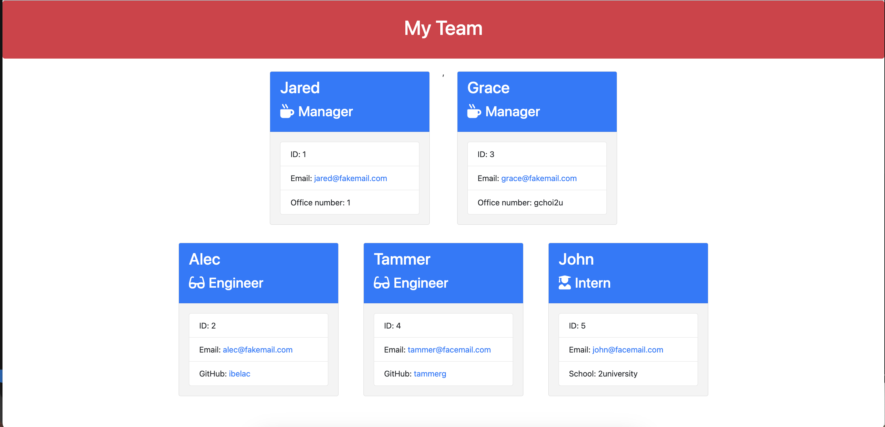

# Team Profile Generator

## Overview
Team Profile Generator is a Node.js command-line application that allows users to create a webpage displaying summaries for each member of a software engineering team. It takes in information about employees, including managers, engineers, and interns, and generates an HTML webpage with their details.

## Deployed Page

[Visit Page](https://aysegulozen.github.io/Team-Profile-Generator/)

## GitHub Repo

[GitHub Repo](https://github.com/Aysegulozen/Team-Profile-Generator)

## Table of Contents
- [Features](#features) 
- [Technologies Used](#technologies-used)
- [Getting Started](#getting-started)
- [Usage](#usage)
- [Tests](#tests)
- [Contributing](#contributing)
- [License](#license)
- [Acknowledgments](#acknowledgments)
- [Screenshots](#screenshots)
- [Live Demo](#live-demo)

## Features
Create Team Members: Users can input information about team members, including name, employee ID, email, and specific details based on their role (manager, engineer, or intern).
Display Team Information: The application generates a webpage that displays summaries for each team member, including their name, role, ID, email, and additional details such as office number, GitHub username, or school.

Search History: Previous searches are stored locally, allowing users to quickly access information for previously entered team members.

## Technologies Used
Node.js
Inquirer.js
Jest (for testing)
HTML

## Getting Started
Clone the repository to your local machine.
Navigate to the project directory.
Install dependencies by running npm install.
Run the application using the command node index.js.
Follow the prompts to enter information about team members and generate the HTML webpage.

## Usage
When prompted, enter information about the team manager, including name, employee ID, email, and office number.
Choose to add additional team members, such as engineers or interns, and enter their information accordingly.
Once all team members have been added, select the option to finish building the team.
The application will generate an HTML file (team.html) in the output folder, displaying summaries for each team member.

## Tests
Unit tests are provided in the {{_tests_}} directory to ensure the functionality of the Employee, Manager, Engineer, and Intern classes.

## Contributing
Contributions are welcome! Please fork the repository and submit a pull request with your changes.

## License
This project is licensed under the MIT License.

## Acknowledgments
This project was completed as part of the edX Boot Camp curriculum.

## Screenshots

## Live Demo
[Watch the Walkthrough Video](https://drive.google.com/file/d/1-NVojZAZ7cskYmevGEN8QaVkpIPwkMx8/view?usp=sharing)

